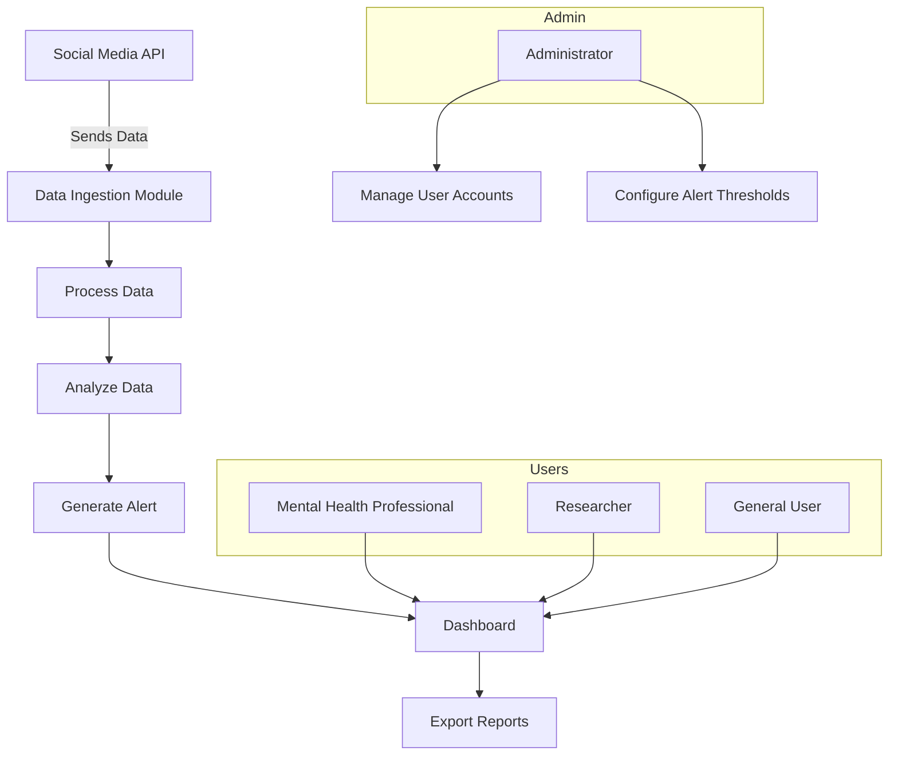

# Use Case Diagram for Bloom: Mental Health App

```mermaid
graph TD
    A[Social Media API] -->|Sends Data| B[Data Ingestion Module]
    B --> C[Process Data]
    C --> D[Analyze Data]
    D --> E[Generate Alert]
    E --> F[Dashboard]

    subgraph Users
        G[Mental Health Professional]
        H[Researcher]
        I[General User]
    end
    G --> F
    H --> F
    I --> F
    F --> J[Export Reports]

    subgraph Admin
        K[Administrator]
    end
    K --> L[Manage User Accounts]
    K --> M[Configure Alert Thresholds]
```
